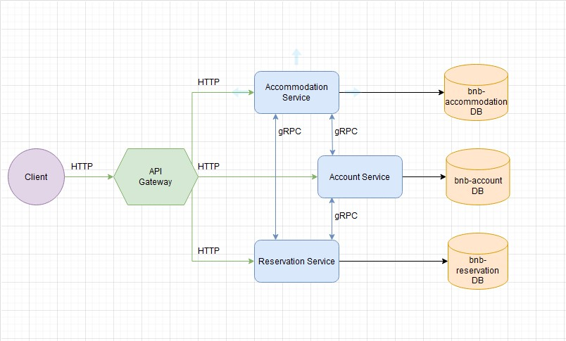

# GlObetrotter 
## Micro Service Application Architecture


## Service models:
Accommodation model
```go
type Accommodation struct {
	Model                 `bson:",inline"`
	Reservations          []*primitive.ObjectID `json:"reservations" bson:"reservations"`
	Name                  string                `json:"name" bson:"name"`
	Location              Address               `json:"location" bson:"location"`
	AvailableCommodations []Commodations        `json:"availableCommodations" bson:"available_commodations"`
	Photos                []string              `json:"photos" bson:"photos"` 
	Guests                int                   `json:"guests" bson:"guests"`
	Availability          TimeInterval          `json:"availability" bson:"availability"`
	UnitPrice             Price                 `json:"unitPrice" bson:"unit_price"`             
	PriceForPerson        bool                  `json:"priceForPerson" bson:"price_for_person"` 
	User                  *primitive.ObjectID   `json:"user" bson:"user"`
	AutoApprove           bool                  `json:"autoApprove" bson:"auto_approve"`  
}
```
Account model
```go
type User struct {
	Model                `bson:",inline"`
	FirstName            string `json:"firstName" bson:"first_name"`
	LastName             string `json:"lastName" bson:"last_name"`
	EMail                string `json:"email" bson:"email"`
	Password             string `json:"password" bson:"password"`
	Role                 string `json:"role" bson:"role"`
	SuperHost            bool   `json:"superHost" bson:"super_host"`
	CancellationsCounter int    `json:"cancellationsCounter" bson:"cancellations_counter"`
	RatingStatus
	Address
}
```

Reservation model
```go
type Reservation struct {
	Model           `bson:",inline"`
	AccommodationId *primitive.ObjectID `json:"accommodationId" bson:"accommodation_id"`
	UserId          *primitive.ObjectID `json:"userId" bson:"user_id"`
	DateInterval    TimeInterval        `json:"dateInterval" bson:"date_interval"`
	NumOfGuests     int                 `json:"numOfGuests" bson:"num_of_guests"`
	IsApproved      bool                `json:"isApproved" bson:"is_approved"`
	TotalPrice      float32             `json:"totalPrice" bson:"total_price"`
}
```


